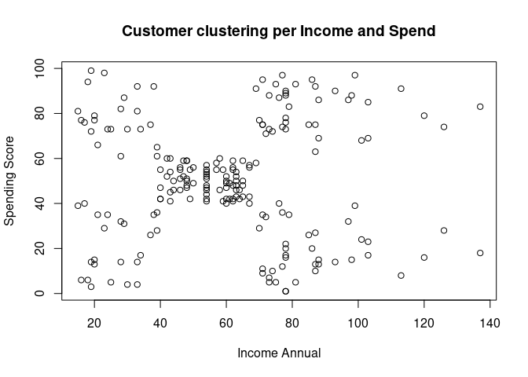
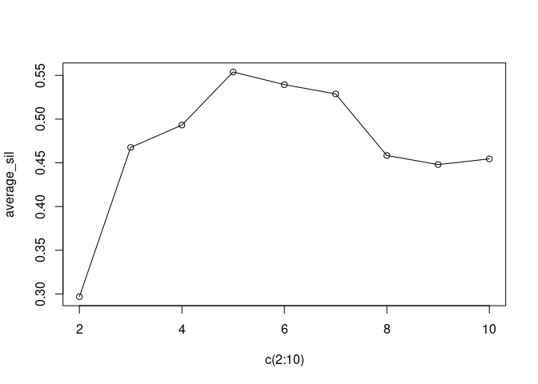
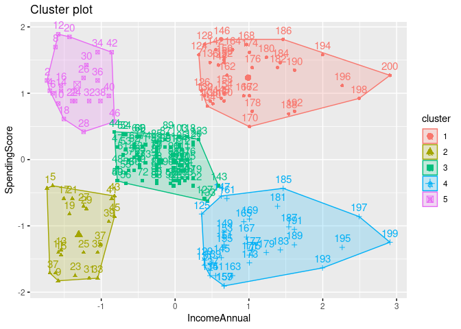

# Customer segmentation with Machine Learning

It is very important for a company to know who its product or service is
aimed at. That is why they look for ways to know the market. This can be
done through market research, among other things. One of the most
efficient is customer segmentation, which allows you to know the public
that consumes your brand.

The code is avaible in the `Costumer-Segmentation.R` file.

The first step is to take a look at our data.

    ##   CustomerID Gender Age Annual.Income..k.. Spending.Score..1.100.
    ## 1          1   Male  19                 15                     39
    ## 2          2   Male  21                 15                     81
    ## 3          3 Female  20                 16                      6
    ## 4          4 Female  23                 16                     77
    ## 5          5 Female  31                 17                     40
    ## 6          6 Female  22                 17                     76

A summary of the data:

    ##    CustomerID        Gender               Age        Annual.Income..k..
    ##  Min.   :  1.00   Length:200         Min.   :18.00   Min.   : 15.00    
    ##  1st Qu.: 50.75   Class :character   1st Qu.:28.75   1st Qu.: 41.50    
    ##  Median :100.50   Mode  :character   Median :36.00   Median : 61.50    
    ##  Mean   :100.50                      Mean   :38.85   Mean   : 60.56    
    ##  3rd Qu.:150.25                      3rd Qu.:49.00   3rd Qu.: 78.00    
    ##  Max.   :200.00                      Max.   :70.00   Max.   :137.00    
    ##  Spending.Score..1.100.
    ##  Min.   : 1.00         
    ##  1st Qu.:34.75         
    ##  Median :50.00         
    ##  Mean   :50.20         
    ##  3rd Qu.:73.00         
    ##  Max.   :99.00

    ## The standard deviation of the spending score 25.82352

    ## The standard deviation of the annual income is 26.26472

------------------------------------------------------------------------

### Data visualitation.

Now that we have a better idea of what the data represent, we will
visualize them in a more graphical way.

##### Gender data:

<!-- -->

##### Age data:

<!-- -->

##### Annual Income data:

<!-- -->

With the visualization of the above graphs, it is possible to get an
idea of the segmentation of the market under study. With the
visualization of these variables alone, you can begin to draw
conclusions.

------------------------------------------------------------------------

### Segmentation

With the visualization of the data through graphs, you have a better
understanding of the elements that you have and the repercussion that
one can have with the other. For customer segmentation, the Machine
Learning K means algorithm was used, which is of great help for the
creation of clusters in the data.

The first step for this is to take the indicated number of cumulus
clusters for the model.

Two methods were used to find the correct number of clusters, the elbow
method and the silhouette method.

Let’s take a look in our data to get a better idea of how th clusters
are made:

<!-- -->

The elbow method provides the following results:

<!-- -->

The silhouette method provides the following results:

<!-- -->

We can see from both graphs that the best number of clusters that can be
chosen is 5.

Now the implementation of the k-meand algorith is:

<!-- -->
